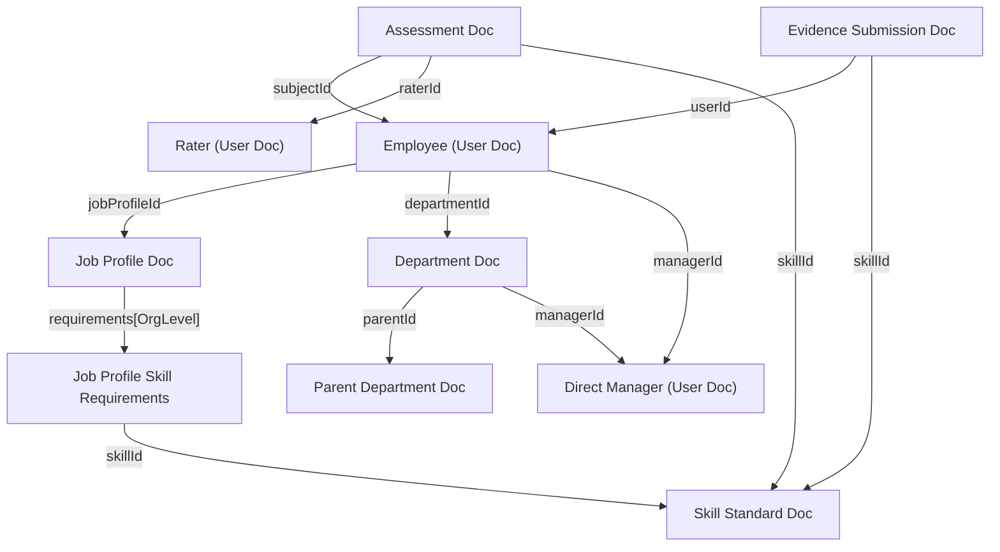

# EPROM Platform: Database & Codebase Linkage Reference

This document provides a comprehensive technical overview of how employee records, skills, assessments, job profiles, and other supporting entities are structurally and logically linked in the **EPROM Competency Management System**.

---

## 🗺️ Architectural Relationship Diagram

The following diagram illustrates how the primary database collections and code modules establish connections, ranging from the core Employee profile down to specific evaluation methods and individual skills.



---

## 👥 1. The Employee Record (`User`)

An employee's profile is stored in the `users` Firestore collection and is defined by the [`User`](./types.ts#L166) interface. It acts as the central hub of the system, linking out to other collections using unique identifier fields:

### A. Core Relational Links
*   **Job Profile Link (`jobProfileId`)**: Links the employee directly to their specific role defined in the `jobProfiles` collection (e.g., *Mechanical Maintenance Engineer*).
*   **Organizational Level (`orgLevel`)**: Represents the employee's current tier in the organizational hierarchy (e.g., `'CEO'`, `'ACEO'`, `'GM'`, `'AGM'`, `'DM'`, `'SH'`, `'SP'`, `'JP'`, `'FR'`).
*   **Department Link (`departmentId`)**: Links the employee to their designated section or department in the `departments` collection.
*   **Supervisor Link (`managerId`)**: Holds the canonical ID of the supervisor/manager they report to.

### B. Embedded Sub-object Arrays (JSON-Serialized in Firestore)
To minimize read requests and database document sizes, certain historical and personal validation logs are kept directly inside the employee's main document as JSON-serialized arrays. These are automatically parsed and structured on load:
*   **Certificates (`certificates`)**: An array of [`Certificate`](./types.ts#L127) objects containing achievement dates, license expiration dates, and verification statuses.
*   **Career History (`careerHistory`)**: An array of [`CareerHistoryEntry`](./types.ts#L154) objects logging promotions, transfers, and historical department or role changes.

---

## 💼 2. Job Profiles & Required Skills

A [`JobProfile`](./types.ts#L97) defines a job role's standards and required skill benchmarks. The relationship between an employee, their job profile, and their required skills works as follows:

1.  An employee is linked to a **Job Profile** via `jobProfileId`.
2.  Each Job Profile specifies required skills inside a `requirements` map grouped by `OrgLevel`:
    ```typescript
    requirements: Partial<Record<OrgLevel, JobProfileSkill[]>>;
    ```
3.  Each [`JobProfileSkill`](./types.ts#L92) specifies:
    *   `skillId`: Refers to a specific standard in the `skills` collection.
    *   `requiredLevel`: The target proficiency score (1 to 5) needed for that tier.

> [!NOTE]
> This structure allows a single **Job Profile** (e.g., *Operations Engineer*) to scale dynamically across multiple organizational levels (e.g. freshers, senior engineers, and department heads) by simply customizing the skills required under each `OrgLevel` key.

---

## 📊 3. Dynamic Skill Scores & Assessments

In EPROM, **skill scores are computed dynamically on-the-fly** rather than stored as static values. This design ensures absolute data auditability. The core algorithm is located in [`getUserSkillScore(userId, skillId)`](./services/store.ts#L1703) and handles scoring based on the skill's defined **Assessment Method**:

### 🧠 A. Behavioral Skills (`OJT_OBSERVATION`)
For behavioral/soft skills, scoring utilizes a multi-source **360-degree feedback** model. The algorithm queries the `assessments` collection for active (non-archived) evaluations where `subjectId == userId` and `skillId == skillId`, then groups them by evaluator type to compute a weighted sum:
*   **Self Assessment** (`type === 'SELF'`): **10%** weight
*   **Peer Assessment** (`type === 'PEER'`): **30%** weight
*   **Manager Assessment** (`type === 'MANAGER'`): **60%** weight
*   **Formula**: $\frac{\text{Weighted Scores}}{\text{Sum of Completed Weights}}$ rounded to the nearest integer.

### ⚙️ B. Technical Skills & Exams (`WRITTEN_EXAM`, `INTERVIEW`, `PRACTICAL_DEMO`)
For technical and operational competencies, scoring uses explicit structured ratings:
1.  **Direct Assessments**: The algorithm first queries the `assessments` collection for active matching exam or interview assessments and returns the score of the **latest** completed assessment.
2.  **Evidence Fallback**: If no direct exam is recorded, the algorithm queries the `evidences` collection. It looks for submissions where `userId == userId`, `skillId == skillId`, and `status === 'APPROVED'`, returning the **highest assigned score** (`assignedScore`) approved by the manager.

---

## 🏢 4. Org Hierarchy & Reporting Lines

Rosters and reporting lines are calculated dynamically based on department configurations and manager fields:

```typescript
// From services/store.ts -> getSubordinates(managerId)
const managedDeptIds = new Set(
  this.departments
    .filter(d => d.managerId === managerId && (d.type === 'DEPARTMENT' || d.type === 'SECTION'))
    .map(d => d.id)
);

return this.users.filter(u =>
  u.id !== managerId && (
    u.managerId === managerId ||
    managedDeptIds.has(u.departmentId)
  )
);
```

An employee is counted as reporting to a supervisor/manager if:
1.  The employee's explicit `managerId` field is set to that supervisor's `id`.
2.  **OR**, the employee is currently in a department or section where `Department.managerId` matches that supervisor's `id`.

> [!IMPORTANT]
> General Departments (e.g., General Manager / CEO level) are excluded from the `managedDeptIds` filter to prevent pulling an entire division's headcount into a single supervisor's direct report queue.

---

## 🔑 5. Relational Fields Summary

The database uses the following fields to tie various collections together:

| From Entity | Relational Field | Targets | Purpose in the System |
| :--- | :--- | :--- | :--- |
| **Employee (`User`)** | `jobProfileId` | `JobProfile.id` | Connects the employee to their professional role. |
| **Employee (`User`)** | `departmentId` | `Department.id` | Scopes data visibility, TNA matrices, and reports. |
| **Employee (`User`)** | `managerId` | `User.id` | Defines the employee's direct supervisor. |
| **Assessment** | `subjectId` | `User.id` | Identifies the employee being evaluated. |
| **Assessment** | `raterId` | `User.id` | Identifies the evaluator (Self, Peer, or Manager). |
| **Assessment** | `skillId` | `Skill.id` | Connects the rating to the precise skill library standard. |
| **Assessment** | `cycleId` | `AssessmentCycle.id` | Places the assessment inside an active evaluation timeframe. |
| **JobProfileSkill** | `skillId` | `Skill.id` | Establishes the required skill target on the Job Profile. |
| **Evidence** | `userId` | `User.id` | Identifies the owner who uploaded the credential. |
| **Evidence** | `skillId` | `Skill.id` | Connects the uploaded document to a technical skill standard. |
| **CareerHistoryEntry**| `jobProfileId` | `JobProfile.id` | References historical roles held by the employee. |
| **CareerHistoryEntry**| `departmentId` | `Department.id` | References historical departments worked in. |
| **Nomination** | `subjectId` | `User.id` | Represents a request for an employee to be evaluated. |
| **IndividualTrainingPlan** | `userId` | `User.id` | Links training courses and recommendation gaps to a specific user. |
